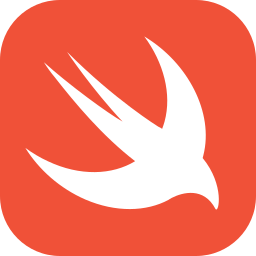

# Hi, I'm Liqi 

**無限進步！** 从模块化应用与云原生，到 AI 工作流与开发者工具。

Shanghai ·  Java ·  Go ·  Python ·  Swift

---

###  我在做什么

我喜欢把复杂的开发和运维问题拆成可以验证的小步骤。过去参与模块化应用、Kubernetes 控制器与命令行工具的开源协作；现在也在探索 Spring AI、MCP、浏览器自动化和原生 macOS 产品。

###  开源贡献

| 项目 | 我提交过的工作 |
| :--- | :--- |
| [SOFAStack / SOFA Serverless](https://github.com/sofastack/sofa-serverless) | 模块部署行为与基线更新 [#118](https://github.com/sofastack/sofa-serverless/pull/118)、Pod 上模块实例统计 [#208](https://github.com/sofastack/sofa-serverless/pull/208)、分组发布的幂等处理 [#406](https://github.com/sofastack/sofa-serverless/pull/406)，以及 CI 与测试改进。该上游仓库现已归档。 |
| [Koupleless / arkctl](https://github.com/koupleless/arkctl) | 用 Go 改进命令行的错误提示 [#1](https://github.com/koupleless/arkctl/pull/1) 和默认帮助输出 [#6](https://github.com/koupleless/arkctl/pull/6)；也向 [Koupleless](https://github.com/koupleless/koupleless/pull/61) 提交过 CI 修复。 |
| [Spring AI Summary](https://github.com/java-ai-tech/spring-ai-summary) | 添加 AI 调用可观测性 [#28](https://github.com/java-ai-tech/spring-ai-summary/pull/28)、Nacos MCP 客户端与服务端示例 [#32](https://github.com/java-ai-tech/spring-ai-summary/pull/32)、评估器—优化器工作流 [#34](https://github.com/java-ai-tech/spring-ai-summary/pull/34)。 |
| [DingTalk OpenClaw Connector](https://github.com/DingTalk-Real-AI/dingtalk-openclaw-connector) | 提交过 Windows 兼容性 [#662](https://github.com/DingTalk-Real-AI/dingtalk-openclaw-connector/issues/662) 和群聊重复回复 [#669](https://github.com/DingTalk-Real-AI/dingtalk-openclaw-connector/issues/669) 的问题报告。 |

[查看我的 GitHub PR 记录 →](https://github.com/pulls?q=is%3Apr+author%3Aliu-657667)

###  正在构建

-  **[MacSoul](https://github.com/liu-657667/macsoul)** — SwiftUI macOS 开发者伴侣，探索如何清晰呈现系统、开发环境与 AI Coding 信息。项目仍在开发中，当前运行版本使用 Mock 数据。
-  **[modao-prototype-inspector](https://github.com/liu-657667/modao-prototype-inspector)** — 一个 Python / Codex skill：从墨刀分享链接扫描页面树，保存结构化视觉证据。

###  技术方向

`Java / Spring` · `Go / CLI` · `Kubernetes / 模块化应用` · `Spring AI / MCP` · `Python / 自动化` · `SwiftUI / macOS`

一条我喜欢的开发原则

> 先把问题看清楚，再写一个可以验证的小版本；每次都比上次前进一点点。

---

**欢迎一起交流开发工具、AI 工作流与开源项目。**

[浏览仓库](https://github.com/liu-657667?tab=repositories) · [查看贡献](https://github.com/pulls?q=is%3Apr+author%3Aliu-657667)

